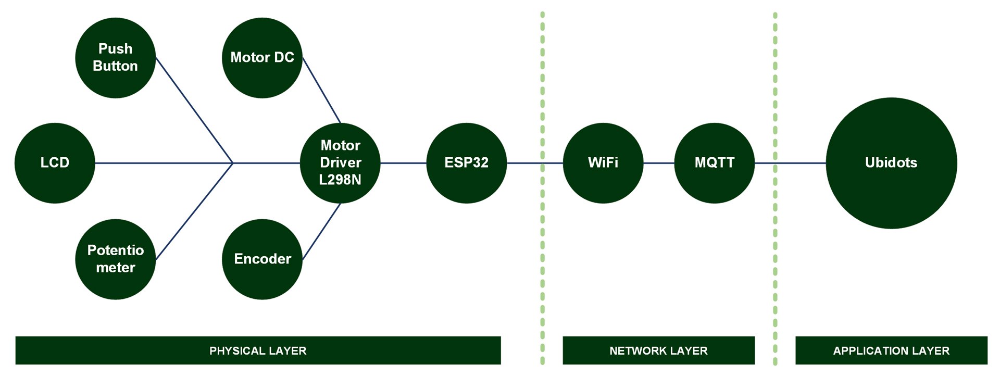

[](https://github.com/ellerbrock/open-source-badges/)
[](https://opensource.org/licenses/MIT)


# Motor-Speed-RPM-PID-Ziegler-Nichols-2-IoT
<strong>Dokumentasi Proyek Skripsi - Informatika UPN Veteran Jatim</strong><br><br>
Di sektor industri, motor konveyor DC biasanya digunakan untuk memindahkan material secara efisien. Mempertahankan kecepatan yang stabil sangat penting untuk memastikan kualitas produk dan kelancaran produksi. Penelitian sebelumnya menghadapi masalah dengan pemilihan mikrokontroler dan implementasi PID yang kurang optimal. Kendali jarak jauh kurang dimanfaatkan, dan integrasi sistem tidak sepenuhnya tersinkronisasi. Kekurangan ini memengaruhi fleksibilitas dan keandalan konveyor. Proyek ini bertujuan untuk meningkatkan kontrol kecepatan dengan integrasi IoT. Mikrokontroler ESP32 mengelola fungsi ON/OFF, arah rotasi, dan setpoint RPM. Ubidots berfungsi sebagai platform pemantauan dan kontrol jarak jauh. Metode PID Ziegler-Nichols diterapkan untuk menstabilkan kecepatan motor. Proyek ini dikembangkan selama satu tahun dan diharapkan dapat meningkatkan efisiensi dan keandalan otomasi industri skala kecil.

<br><br>

## Kebutuhan Proyek
| Bagian | Deskripsi |
| --- | --- |
| Papan Pengembangan | DOIT ESP32 DEVKIT V1 |
| Editor Kode | Arduino IDE |
| Driver | CP210X USB Driver |
| Platform IoT | Ubidots |
| Protokol Komunikasi | • Inter Integrated Circuit (I2C)<br>• Message Queuing Telemetry Transport (MQTT) |
| Arsitektur IoT | 3 Lapisan |
| Bahasa Pemrograman | C/C++ |
| Pustaka Arduino | • WiFi (default)<br>• PubSubClient<br>• LiquidCrystal_I2C<br>• ArduinoJson<br>• ESP32Encoder |
| Aktuator | Motor DC JGA25-370 (x1) |
| Sensor | Sensor Encoder (x1) |
| Layar | LCD I2C (x1) |
| Komponen Lainnya | • Kabel USB tipe C - USB tipe A (x1)<br>• Kabel jumper (1 set)<br>• Female DC power adapter (x1)<br>• Tombol tekan 12 x 12 mm (x2)<br>• Motor driver L298N (x1)<br>• Potensiometer (x1)<br>• Adaptor 12V 2A (x1)<br>• Adaptor 5V 2A (x1)<br>• Breadboard (x1)<br>• Kayu triplek 50 x 50 cm (x2)<br>• Beton Baja Stainless Steel 30 cm (x1)<br>• Pipa 1/2 Inchi 25 cm (x1)<br>• Kain Oscar 50 x 137 cm (x1)<br>• Baut spicer (1 set)<br>• Baut plus (1 set)<br>• Mur (1 set)<br>• Braket L (1 set)<br>• Isolasi listrik PVC (1 set)<br>• Amplas G-180 1 m (x1)<br>• Velg Smart Car (x1) |

<br><br>

## Unduh & Instal
1. Arduino IDE

   <table><tr><td width="810">
      
   ```
   https://www.arduino.cc/en/software
   ```

   </td></tr></table><br>

2. CP210X USB Driver

   <table><tr><td width="810">

   ```
   https://bit.ly/CP210X_USBdriver
   ```

   </td></tr></table><br>

<br><br>

## Rancangan Proyek
<table>
<tr>
<th width="840">Infrastruktur</th>
</tr>
<tr>
<td></td>
</tr>
</table>
<table>
<tr>
<th width="420">Diagram Blok</th>
<th width="420">Diagram Ilustrasi</th>
</tr>
<tr>
<td></td>
<td></td>
</tr>
</table>
<table>
<tr>
<th width="840" colspan="2">Desain Prototipe</th>
</tr>
<tr>
<td width="420"></td>
<td width="420"></td>
</tr>
</table>
<table>
<tr>
<th width="840" colspan="3">Cetak Biru Sistem Konveyor</th>
</tr>
<tr>
<td width="280"></td>
<td width="280"></td>
<td width="280"></td>
</tr>
</table>
<table>
<tr>
<th width="840">Pengkabelan</th>
</tr>
<tr>
<td></td>
</tr>
</table>

<br><br>

## Kalibrasi CPR
<table><tr><td width="840">

```ino
// Library untuk membaca Magnetic/Optical Encoder dengan ESP32
#include <ESP32Encoder.h>

// Channel A dari encoder terhubung ke pin GPIO 34
#define encoderA 34

// Channel B dari encoder terhubung ke pin GPIO 35
#define encoderB 35

// Objek encoder dari library ESP32Encoder
ESP32Encoder encoder;

// Hitungan awal encoder (saat mulai kalibrasi)
long startEncoderCount = 0;      

// Hitungan encoder sebelumnya (untuk menghitung delta)
long lastEncoderCount = 0;

// Selisih antara hitungan sekarang dan sebelumnya
long deltaEncoderCount = 0;

// Count per Revolution (jumlah hitungan dalam satu putaran penuh)
float CPR = 0;

// Pulse per Revolution (jumlah pulsa 1 channel dalam satu putaran)
float PPR = 0;

// Rasio gearbox antara motor dan output shaft
float gearRatio = 0;

// Encoder internal PPR (biasanya 11, tergantung spesifikasi motor)
const float encoderPPR_Internal = 11.0;

// Total perkiraan putaran output shaft
float totalPutaranOutput = 0;

// Target putaran output shaft untuk kalibrasi (default: 1 putaran penuh)
int putaranOutputTarget = 1;

// Status apakah kalibrasi telah selesai
bool kalibrasiSelesai = false;


// Fungsi untuk menampilkan panduan di Serial Monitor
void tampilkanPanduan() {
  Serial.println("================================================");
  Serial.println("                  KALIBRASI CPR                 ");
  Serial.println("================================================");
  Serial.println("Langkah-langkah:");
  Serial.println("1. Pastikan motor dan encoder terhubung.");
  Serial.println("2. Putar shaft OUTPUT searah jarum jam.");
  Serial.println("3. Putar 1x penuh (360 derajat) dengan stabil.");
  Serial.println("4. Tunggu hasil kalibrasi muncul.");
  Serial.println("------------------------------------------------");
}


// Fungsi setup akan dijalankan sekali saat board ESP32 dinyalakan
void setup() {
  
  // Inisialisasi komunikasi Serial dengan baudrate 115200
  Serial.begin(115200);

  // Hubungkan encoder dengan metode Full Quadrature (4x resolusi)
  encoder.attachFullQuad(encoderB, encoderA);

  // Reset hitungan encoder ke 0
  encoder.clearCount();

  // Simpan hitungan awal sebagai referensi
  lastEncoderCount = encoder.getCount();

  // Simpan juga sebagai nilai awal kalibrasi
  startEncoderCount = lastEncoderCount;

  while (!Serial) {
    ; // Tunggu hingga Serial Monitor siap
  }

  // Delay untuk memastikan Serial Monitor benar-benar siap
  delay(5000);
  
  // Tampilkan instruksi kalibrasi ke user
  tampilkanPanduan();
}


// Fungsi loop akan dijalankan berulang kali (secara terus menerus)
void loop() {
  
  // Jika kalibrasi sudah selesai, hentikan loop (tidak lakukan apa-apa)
  if (kalibrasiSelesai) return;

  // Baca nilai hitungan encoder saat ini
  long currentCount = encoder.getCount();
  
  // Hitung perubahan dari pembacaan terakhir
  deltaEncoderCount = currentCount - lastEncoderCount;

  // Estimasi pertambahan putaran output, berdasarkan perubahan hitungan encoder
  // Hanya jika terjadi putaran maju
  if (deltaEncoderCount > 0) {

    // Tambahkan ke total putaran output (500 hanya perkiraan awal)
    totalPutaranOutput += deltaEncoderCount / 500.0;

    // Jika total putaran output sudah mencapai target (misal: 1 putaran penuh)
    if (totalPutaranOutput >= putaranOutputTarget) {
      
      // Tandai kalibrasi selesai
      kalibrasiSelesai = true;

      // Hitungan total encoder selama 1 putaran
      long totalCountSelama1Putaran = currentCount - startEncoderCount;

      // Count Per Revolution
      CPR = (float)totalCountSelama1Putaran;

      // Hitungan per pulsa (karena Full Quad, dibagi 4)
      PPR = CPR / 4.0;

      // Estimasi rasio gearbox
      gearRatio = CPR / (encoderPPR_Internal * 4.0);

      // Bulatkan hasil agar lebih mudah dibaca
      int PPR_bulat = round(PPR);
      int CPR_bulat = round(CPR);
      int gearRatio_bulat = round(gearRatio);

      // Tampilkan hasil kalibrasi
      Serial.println();
      Serial.println("================ HASIL KALIBRASI ===============");
      Serial.print("PPR (Pulse/Revolusi)   =  "); Serial.println(PPR_bulat);
      Serial.print("CPR (Count/Revolusi)   =  "); Serial.println(CPR_bulat);
      Serial.print("Gear Ratio (Motor:Out) =  1:"); Serial.println(gearRatio_bulat);
      Serial.println("================================================");
      Serial.println("✅ Kalibrasi selesai. Gunakan nilai di atas.");
    }
  }

  // Update hitungan encoder terakhir
  lastEncoderCount = currentCount;
}
```

</td></tr></table><br><br>

## Pengaturan Arduino IDE
1. Buka ``` Arduino IDE ``` terlebih dahulu, kemudian buka proyek dengan cara klik ``` File ``` -> ``` Open ``` :

   <table><tr><td width="810">
      
      ``` Main.ino ```

   </td></tr></table><br>
   
2. Isi ``` Url Pengelola Papan Tambahan ``` di Arduino IDE

   <table><tr><td width="810">
      
      Klik ``` File ``` -> ``` Preferences ``` -> masukkan ``` Boards Manager Url ``` dengan menyalin tautan berikut :
      
      ```
      https://dl.espressif.com/dl/package_esp32_index.json
      ```

   </td></tr></table><br>
   
3. ``` Pengaturan Board ``` di Arduino IDE

   <table>
      <tr><th width="810">

      Cara mengatur board ``` DOIT ESP32 DEVKIT V1 ```
            
      </th></tr>
      <tr><td>
      
      • Klik ``` Tools ``` -> ``` Board ``` -> ``` Boards Manager ``` -> Instal ``` esp32 ```.
   
      • Kemudian pilih papan dengan mengklik: ``` Tools ``` -> ``` Board ``` -> ``` ESP32 Arduino ``` -> ``` DOIT ESP32 DEVKIT V1 ```.

      </td></tr>
   </table><br>
   
4. ``` Ubah Kecepatan Papan ``` di Arduino IDE

   <table><tr><td width="810">
      
      Klik ``` Tools ``` -> ``` Upload Speed ``` -> ``` 115200 ```

   </td></tr></table><br>
   
5. ``` Instal Pustaka ``` di Arduino IDE

   <table><tr><td width="810">
      
      Unduh semua file zip pustaka. Kemudian tempelkan di: ``` C:\Users\Computer_Username\Documents\Arduino\libraries ```

   </td></tr></table><br>

6. ``` Pengaturan Port ``` di Arduino IDE

   <table><tr><td width="810">
      
      Klik ``` Port ``` -> Pilih sesuai dengan port perangkat anda ``` (anda dapat melihatnya di Device Manager) ```

   </td></tr></table><br>

7. Ubah ``` Nama WiFi ```, ``` Kata Sandi WiFi ```, dan sebagainya sesuai dengan apa yang anda gunakan saat ini.<br><br>

8. Sebelum mengunggah program, silakan klik: ``` Verify ```.<br><br>

9. Jika tidak ada kesalahan dalam kode program, silakan klik: ``` Upload ```.<br><br>
    
10. Beberapa hal yang perlu anda lakukan saat menggunakan ``` board ESP32 ``` :

    <table><tr><td width="810">
       
       • Jika ``` board ESP32 ``` tidak dapat memproses ``` Source Code ``` secara total -> Tekan tombol ``` EN (RST) ``` -> ``` Restart ```.

       • Jika ``` board ESP32 ``` tidak dapat memproses ``` Source Code ``` secara otomatis maka :<br>

      - Ketika informasi: ``` Uploading... ``` telah muncul -> segera tekan dan tahan tombol ``` BOOT ```.<br>

      - Ketika informasi: ``` Writing at .... (%) ``` telah muncul -> lepaskan tombol ``` BOOT ```.

       • Jika pesan: ``` Done Uploading ``` telah muncul -> ``` Program yang diisikan tadi sudah bisa dioperasikan ```.

       • Jangan tekan tombol ``` BOOT ``` dan ``` EN ``` secara bersamaan karena hal ini bisa beralih ke mode ``` Unggah Firmware ```.

    </td></tr></table><br>

11. Jika masih ada masalah saat unggah program, maka coba periksa pada bagian ``` driver ``` / ``` port ``` / ``` yang lainnya ```.

<br><br>

## Pengaturan Ubidots
1. Memulai Ubidots : 

   <table><tr><td width="810">
   
      • Silakan <a href="https://industrial.ubidots.com/accounts/signin/">Masuk</a> agar dapat mengakses layanan ``` Ubidots ```.
      
      • Jika anda belum memiliki akun ``` Ubidots ``` silakan buat dulu.

   </td></tr></table><br>

2. Membuat dasbor :

   <table><tr><td width="810">
   
      • Pada bagian ``` Data ``` -> pilih menu ``` Dashboards ```.
   
      • Hapus dasbor demo bawaan Ubidots sebelum membuat dasbor baru.
   
      • Klik ``` Add new Dashboard ```.
   
      • ``` Name ```, ``` Tags ```, ``` Default time range ``` -> sesuaikan dengan kebutuhan anda.

      • ``` Dynamic Dashboard ``` -> ubah menjadi ``` Dynamic (Single Device) ```.

      • ``` Default Device ``` -> pilih device yang ingin ditampilkan.

      • Pengaturan yang lain biarkan saja -> kemudian klik ``` SAVE ```.

   </td></tr></table><br>

3. Membuat widget line chart :

   <table><tr><td width="810">
   
      • Pastikan anda berada di menu ``` Dashboards ```.
   
      • Klik ``` + Add new widget ```.
   
      • Pilih ``` Line chart ``` untuk visualisasi data.
   
      • Silakan atur variabel yang ingin anda gunakan pada widget yaitu dengan cara klik ``` + ADD VARIABLE ```, kemudian klik ``` ✅ Checklist ``` untuk menyimpan.
   
      • Jika ingin mengubah isi widget, silakan klik simbol ``` pensil ``` -> jika sudah, kemudian klik ``` ✅ Checklist ``` untuk menyimpan.

   </td></tr></table><br>

4. Membuat widget switch :

   <table><tr><td width="810">
   
      • Pastikan anda berada di menu ``` Dashboards ```.
   
      • Klik ``` + Add new widget ```.
   
      • Pilih ``` Switch ``` untuk kontrol ON/OFF dan untuk kontrol arah putaran motor DC.
   
      • Silakan atur variabel yang ingin anda gunakan pada widget yaitu dengan cara klik ``` + ADD VARIABLE ```, kemudian klik ``` ✅ Checklist ``` untuk menyimpan.
   
      • Jika ingin mengubah isi widget, silakan klik simbol ``` pensil ``` -> jika sudah, kemudian klik ``` ✅ Checklist ``` untuk menyimpan.

   </td></tr></table><br>

5. Membuat widget indicator :

   <table><tr><td width="810">
   
      • Pastikan anda berada di menu ``` Dashboards ```.
   
      • Klik ``` + Add new widget ```.
   
      • Pilih ``` Indicator ``` untuk mengetahui status ON/OFF dan status arah putaran motor DC.
   
      • Silakan atur variabel yang ingin anda gunakan pada widget yaitu dengan cara klik ``` + ADD VARIABLE ```, kemudian klik ``` ✅ Checklist ``` untuk menyimpan.
   
      • Jika ingin mengubah isi widget, silakan klik simbol ``` pensil ``` -> jika sudah, kemudian klik ``` ✅ Checklist ``` untuk menyimpan.

   </td></tr></table><br>

6. Konfigurasi firmware : 

   <table><tr><td width="810">
   
      • Klik bagian ``` User ``` yang ada di pojok kiri bawah -> lalu pilih ``` API Credentials ```.
   
      • Salin ``` Default token ``` -> lalu tempelkan pada kode firmware. Contohnya sebagai berikut:

      <table><tr><td width="780">
   
      ```ino
      const String token = "BBUS-aRZvtYRMM7IWbrKFcICR30YYP7dh5Q"; // define ubidots token
      ```

      </td></tr></table>

   </td></tr></table>

<br><br>

## Memulai
1. Unduh dan ekstrak repositori ini.<br><br>

2. Pastikan anda memiliki komponen elektronik yang diperlukan.<br><br>
   
3. Pastikan komponen anda telah dirancang sesuai dengan diagram.<br><br>
   
4. Konfigurasikan perangkat anda menurut pengaturan di atas.<br><br>
    
5. Selamat menikmati [Selesai].

<br><br>

## Sorotan
<table>
<tr>
<th width="840" colspan="2">Produk</th>
</tr>
<tr>
<td width="420"></td>
<td width="420"></td>
</tr>
</table>
<table>
<tr>
<th width="840" colspan="3">Konektivitas Wi-Fi</th>
</tr>
<tr>
<td width="280"></td>
<td width="280"></td>
<td width="280"></td>
</tr>
</table>
<table>
<tr>
<th width="840" colspan="4">Konektivitas IoT</th>
</tr>
<tr>
<td width="210"></td>
<td width="210"></td>
<td width="210"></td>
<td width="210"></td>
</tr>
</table>
<table>
<tr>
<th width="840" colspan="4">Publish-Subscribe MQTT</th>
</tr>
<tr>
<td width="210"></td>
<td width="210"></td>
<td width="210"></td>
<td width="210"></td>
</tr>
</table>
<table>
<tr>
<th width="840" colspan="5">Tampilan LCD</th>
</tr>
<tr>
<td width="168"></td>
<td width="168"></td>
<td width="168"></td>
<td width="168"></td>
<td width="168"></td>
</tr>
</table>
<table>
<tr>
<th width="420">Monitor Serial</th>
<th width="420">Plotter Serial</th>
</tr>
<tr>
<td></td>
<td></td>
</tr>
</table>
<table>
<tr>
<th width="420">Kontrol dan Indikator Ubidots</th>
<th width="420">Grafik Garis Ubidots</th>
</tr>
<tr>
<td></td>
<td></td>
</tr>
</table>

<br><br>
<strong>Informasi lebih lanjut:</strong><br>
<table><tr><td width="840">
   • Skripsi : <a href="https://repository.upnjatim.ac.id/38675"><u>Akses 1</u></a> atau <a href="https://github.com/cakraawijaya/Motor-Speed-RPM-PID-Ziegler-Nichols-2-IoT/tree/master/Assets/Documentation/Report"><u>Akses 2</u></a><br><br>
   • Jurnal : <a href="https://journal.citradharma.org/index.php/literasinusantara/article/view/1593"><u>Klik Disini</u></a>
</td></tr></table>

<br><br>

## Apresiasi
Jika karya ini bermanfaat bagi anda, maka dukunglah karya ini sebagai bentuk apresiasi kepada penulis dengan mengklik tombol ``` ⭐Bintang ``` di bagian atas repositori.

<br><br>

## Penafian
Aplikasi ini merupakan hasil kerja keras rekan saya yang bernama Hawin, bukan merupakan hasil plagiat dari penelitian atau karya orang lain, kecuali yang berkaitan dengan layanan pihak ketiga yang meliputi: library, framework, dan lain sebagainya. Dalam proyek ini saya hanya bertindak sebagai mentor. Publikasi karya ini telah mendapatkan ijin dari pihak yang bersangkutan sesuai dengan yang telah disepakati di awal, yaitu untuk pengembangan ilmu pengetahuan.

<br><br>

## LISENSI
LISENSI MIT - Hak Cipta © 2025 - Moch Hawin Hamami & Devan C. M. Wijaya, S.Kom

Dengan ini diberikan izin tanpa biaya kepada siapa pun yang mendapatkan salinan perangkat lunak ini dan file dokumentasi terkait perangkat lunak untuk menggunakannya tanpa batasan, termasuk namun tidak terbatas pada hak untuk menggunakan, menyalin, memodifikasi, menggabungkan, mempublikasikan, mendistribusikan, mensublisensikan, dan/atau menjual salinan Perangkat Lunak ini, dan mengizinkan orang yang menerima Perangkat Lunak ini untuk dilengkapi dengan persyaratan berikut:

Pemberitahuan hak cipta di atas dan pemberitahuan izin ini harus menyertai semua salinan atau bagian penting dari Perangkat Lunak.

DALAM HAL APAPUN, PENULIS ATAU PEMEGANG HAK CIPTA DI SINI TETAP MEMILIKI HAK KEPEMILIKAN PENUH. PERANGKAT LUNAK INI DISEDIAKAN SEBAGAIMANA ADANYA, TANPA JAMINAN APAPUN, BAIK TERSURAT MAUPUN TERSIRAT, OLEH KARENA ITU JIKA TERJADI KERUSAKAN, KEHILANGAN, ATAU LAINNYA YANG TIMBUL DARI PENGGUNAAN ATAU URUSAN LAIN DALAM PERANGKAT LUNAK INI, PENULIS ATAU PEMEGANG HAK CIPTA TIDAK BERTANGGUNG JAWAB, KARENA PENGGUNAAN PERANGKAT LUNAK INI TIDAK DIPAKSAKAN SAMA SEKALI, SEHINGGA RISIKO ADALAH MILIK ANDA SENDIRI.