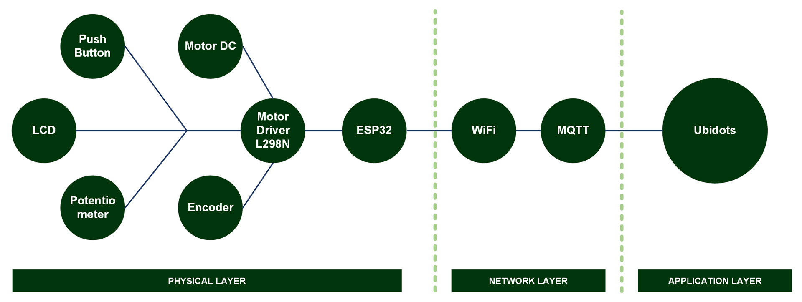

[](https://github.com/ellerbrock/open-source-badges/)
[](https://opensource.org/licenses/MIT)


# Motor Speed RPM - PID Ziegler Nichols 2 - IoT
<strong>Undergraduate Thesis Project Documentation - Informatics UPN Veteran Jatim</strong><br><br>
In the industrial sector, DC conveyor motors are commonly used to move materials efficiently. Maintaining a stable speed is essential to ensure product quality and smooth production. Previous research faced issues with microcontroller selection and suboptimal PID implementation. Remote control was underutilized, and system integration was not fully synchronized. These shortcomings affected the flexibility and reliability of the conveyor. This project aims to improve speed control with IoT integration. The ESP32 microcontroller manages ON/OFF functions, rotation direction, and RPM setpoint. Ubidots serves as the remote monitoring and control platform. The Ziegler-Nichols PID method is applied to stabilize motor speed. The project was developed over one year and is expected to enhance the efficiency and reliability of small-scale industrial automation.

<br><br>

## Project Requirements
| Part | Description |
| --- | --- |
| Development Board | DOIT ESP32 DEVKIT V1 |
| Code Editor | Arduino IDE 1.8.19 (Stable Legacy Version) |
| Driver | CP210X USB Driver |
| IoT Platform | Ubidots |
| Communications Protocol | • Inter Integrated Circuit (I2C)<br>• Message Queuing Telemetry Transport (MQTT) |
| IoT Architecture | 3 Layer |
| Programming Language | C/C++ |
| Arduino Library | • WiFi (default)<br>• PubSubClient by Nick O'Leary (Version: 2.8)<br>• LiquidCrystal_I2C by Frank de Brabander (Version: 1.1.2)<br>• ArduinoJson by Benoit Blanchon (Version: 7.4.1)<br>• ESP32Encoder by Kevin Harrington (Version: 0.11.7) |
| Actuators | Motor DC JGA25-370 (x1) |
| Sensor | Encoder Sensor (x1) |
| Display | LCD I2C (x1) |
| Other Components | • USB type C - USB type A cable (x1)<br>• Jumper cable (1 set)<br>• Female DC power adapter (x1)<br>• Push button 12 x 12 mm (x2)<br>• Motor driver L298N (x1)<br>• Potentiometer (x1)<br>• Adaptor 12V 2A (x1)<br>• Adaptor 5V 2A (x1)<br>• Breadboard (x1)<br>• Plywood 50 x 50 cm (x2)<br>• Stainless Steel Concrete 30 cm (x1)<br>• 1/2 Inch Pipe 25 cm (x1)<br>• Oscar fabric 50 x 137 cm (x1)<br>• Spicer bolts (1 set)<br>• Bolts plus (1 set)<br>• Nuts (1 set)<br>• L Bracket (1 set)<br>• PVC Electrical insulation (1 set)<br>• Sandpaper G-180 1 m (x1)<br>• Smart Car Rims (x1) |

<br><br>

## Download & Install 
1. Arduino IDE

   <table><tr><td width="810">

   ```
   https://www.arduino.cc/en/software
   ```

   </td></tr></table><br>

2. CP210X USB Driver

   <table><tr><td width="810">

   ```
   https://bit.ly/CP210X_USBdriver
   ```

   </td></tr></table>

<br><br>

## Project Designs
<table>
<tr>
<th width="840">Infrastructure</th>
</tr>
<tr>
<td></td>
</tr>
</table>
<table>
<tr>
<th width="420">Block Diagram</th>
<th width="420">Pictorial Diagram</th>
</tr>
<tr>
<td></td>
<td></td>
</tr>
</table>
<table>
<tr>
<th width="840" colspan="2">Prototype Design</th>
</tr>
<tr>
<td width="420"></td>
<td width="420"></td>
</tr>
</table>
<table>
<tr>
<th width="840" colspan="3">Conveyor System Blueprint</th>
</tr>
<tr>
<td width="280"></td>
<td width="280"></td>
<td width="280"></td>
</tr>
</table>
<table>
<tr>
<th width="840">Wiring</th>
</tr>
<tr>
<td></td>
</tr>
</table>

<br><br>

## Scanning the I2C Address on the LCD
<table><tr><td width="840">

```ino
/*
  =====================================================
  I2C Scanner for Arduino / ESP32 / ESP8266
  by: Devan Cakra Mudra Wijaya, S.Kom.
  =====================================================

  Functions:
  - Detects all connected I2C devices
  - Displays device addresses in HEX format
  - Displays the total number of detected devices


  =====================================================
  SDA and SCL Pins for Arduino / ESP32 / ESP8266
  =====================================================
  Arduino I2C Connection (default):
  - Arduino Uno / Nano (ATmega328P)
    SDA -> A4
    SCL -> A5

  - Arduino Mega 2560
    SDA -> D20
    SCL -> D21

  - Other Arduino boards
    SDA -> SDA pin
    SCL -> SCL pin
    (Refer to the datasheet or board pinout)

  ESP32 I2C Connection (default):
  SDA -> GPIO 21
  SCL -> GPIO 22

  ESP8266 I2C Connection (default):
  SDA -> GPIO 4 (D2)
  SCL -> GPIO 5 (D1)
*/

// Include the Wire library for I2C communication
#include <Wire.h>

// Constant that defines the delay between scans (5000 ms = 5 seconds)
const uint32_t SCAN_INTERVAL = 5000;


// Function to initialize I2C communication
// SDA and SCL pin configuration will be adjusted automatically based on the board being used
void initI2C() {

  // If the board being used is ESP32:
  #if defined(ESP32)

    // Enable I2C communication
    // SDA = GPIO21
    // SCL = GPIO22
    Wire.begin(21, 22);

  // If the board being used is ESP8266:
  #elif defined(ESP8266)

    // Enable I2C communication
    // SDA = D2 (GPIO4)
    // SCL = D1 (GPIO5)
    Wire.begin(D2, D1);

  // If the board is neither ESP32 nor ESP8266
  // Examples: Arduino Uno, Nano, Mega, Leonardo, etc.
  #else

    // Enable I2C communication using the board's built-in hardware pins
    Wire.begin();

  #endif

}


// The setup() function runs once when the board is powered on or reset
// It is used to initialize hardware, serial communication, sensors, modules, and the program's initial configuration
void setup() {

  // Start Serial communication at 115200 baud rate
  Serial.begin(115200);

  // Check whether the board uses native USB
  // Examples: Arduino Leonardo, Arduino Micro, some ESP32-S2/S3 boards
  #if defined(USBCON) || defined(ARDUINO_USB_CDC_ON_BOOT)

    // If yes:
    // The program will wait until the Serial Monitor is connected before continuing execution
    while (!Serial);

  #endif

  // Wait for 2 seconds before starting the program
  delay(2000);

  // Display program header
  Serial.println("====================================");
  Serial.println("         I2C DEVICE SCANNER         ");
  Serial.println("by: Devan Cakra Mudra Wijaya, S.Kom.");
  Serial.println("====================================");

  // Print an empty line
  Serial.println();

  // Initialize I2C communication
  initI2C();
}


// The loop() function runs continuously after setup() has finished
// The main program logic is typically placed inside this function
void loop() {

  // Variable to store the error code returned from I2C communication
  uint8_t error;

  // Variable to store the I2C address currently being checked
  uint8_t address;

  // Counter variable for the number of detected devices
  uint8_t deviceCount = 0;

  // Display information indicating that the scan process has started
  Serial.println("------------------------------------");
  Serial.println("Scanning I2C bus...");
  Serial.println("------------------------------------");

  // Loop through addresses from 1 to 126
  // Valid I2C addresses range from 0x01 to 0x7E
  for (address = 1; address < 127; address++) {

    // Start communication with the address currently being tested
    Wire.beginTransmission(address);

    // End the transmission and store the result
    // 0 = success
    // 1 = data too long
    // 2 = NACK received when address was sent
    // 3 = NACK received when data was sent
    // 4 = other error
    error = Wire.endTransmission();

    // If no error occurs:
    if (error == 0) {

      // Display information that a device was found
      Serial.print("[FOUND] Device at address 0x");

      // If the address is less than 16:
      // Add a leading zero to keep HEX formatting aligned
      if (address < 16) {
        Serial.print("0");
      }

      // Display the address in HEX format
      Serial.println(address, HEX);

      // Increment the detected device count
      deviceCount++;
    }

    // If an unknown error occurs:
    else if (error == 4) {

      // Display an error message
      Serial.print("[ERROR] Unknown error at address 0x");

      // If the address is less than 16:
      // Add a leading zero to keep HEX formatting aligned
      if (address < 16) {
        Serial.print("0");
      }

      // Display the problematic address in HEX format
      Serial.println(address, HEX);
    }

    // If the error is neither 0 nor 4:
    // Ignore it, as this usually means no device exists at that address
  }

  // Print an empty line
  Serial.println();

  // If no devices were found:
  if (deviceCount == 0) {

    // Display a message indicating that no devices were found
    Serial.println("No I2C devices found.");
  }
  else { // If at least one device was found:

    // Display the total number of detected devices
    Serial.print("Total devices found: ");

    // Display the value of deviceCount
    Serial.println(deviceCount);
  }

  // Display information about the next scan
  Serial.print("Next scan in ");

  // Convert milliseconds to seconds
  Serial.print(SCAN_INTERVAL / 1000);

  // Display the unit in seconds
  Serial.println(" seconds.");

  // Empty line
  Serial.println("\n");

  // Wait 5 seconds before performing the next scan
  delay(SCAN_INTERVAL);
}
```

</td></tr></table><br><br>

## CPR Calibration
<table><tr><td width="840">

```ino
// Library to read Magnetic/Optical Encoder with ESP32
#include <ESP32Encoder.h>

// Channel A of the encoder is connected to GPIO pin 34
#define encoderA 34

// Channel B of the encoder is connected to GPIO pin 35
#define encoderB 35

// Encoder object from the ESP32Encoder library
ESP32Encoder encoder;

// Encoder initial count (when starting calibration)
long startEncoderCount = 0;      

// Previous encoder count (to calculate delta)
long lastEncoderCount = 0;

// Difference between current and previous count
long deltaEncoderCount = 0;

// Count per Revolution (number of counts in one full revolution)
float CPR = 0;

// Pulse per Revolution (number of pulses of 1 channel in one revolution)
float PPR = 0;

// Gearbox ratio between motor and output shaft
float gearRatio = 0;

// PPR internal encoder (usually 11, depending on motor specifications)
const float encoderPPR_Internal = 11.0;

// Total estimated output shaft rotation
float totalOutputRotation = 0;

// Output shaft rotation target for calibration (default: 1 full rotation)
int outputRotationTarget = 1;

// Status of whether the calibration has been completed
bool calibrationDone = false;


// Function to display the guide on the Serial Monitor
void showInstructions() {
  Serial.println("================================================");
  Serial.println("                 CPR CALIBRATION                ");
  Serial.println("================================================");
  Serial.println("Steps:");
  Serial.println("1. Make sure the motor and encoder are connected.");
  Serial.println("2. Turn the OUTPUT shaft clockwise.");
  Serial.println("3. Rotate 1x full (360 degrees) steadily.");
  Serial.println("4. Wait for the calibration result to appear.");
  Serial.println("------------------------------------------------");
}


// The setup function will be executed once when the ESP32 board is powered on
void setup() {
  
  // Initialize Serial communication with baudrate 115200
  Serial.begin(115200);

  // Connect encoder with Full Quadrature method (4x resolution)
  encoder.attachFullQuad(encoderB, encoderA);

  // Reset encoder count to 0
  encoder.clearCount();

  // Save the initial count as a reference
  lastEncoderCount = encoder.getCount();

  // Also save as initial calibration value
  startEncoderCount = lastEncoderCount;

  while (!Serial) {
    ; // Wait for the Serial Monitor to be ready
  }

  // Delay to ensure Serial Monitor is completely ready
  delay(5000);
  
  // Display calibration instructions to user
  showInstructions();
}


// The loop function will be executed repeatedly (continuously)
void loop() {
  
  // If the calibration is complete, stop the loop (do nothing)
  if (calibrationDone) return;

  // Read the current encoder count value
  long currentCount = encoder.getCount();
  
  // Calculate the change from the last reading
  deltaEncoderCount = currentCount - lastEncoderCount;

  // Estimation of output rotation increment, based on encoder count change
  // Only if forward rotation occurs
  if (deltaEncoderCount > 0) {

    // Add to total output revolutions (500 is just an initial estimate)
    totalOutputRotation += deltaEncoderCount / 500.0;

    // If the total output rotation has reached the target (e.g. 1 full rotation)
    if (totalOutputRotation >= outputRotationTarget) {
      
      // Mark calibration complete
      calibrationDone = true;

      // Total encoder count for 1 revolution
      long totalCountsInOneRotation = currentCount - startEncoderCount;

      // Count Per Revolution
      CPR = (float)totalCountsInOneRotation;

      // Counts per pulse (due to Full Quad, divided by 4)
      PPR = CPR / 4.0;

      // Estimated gearbox ratio
      gearRatio = CPR / (encoderPPR_Internal * 4.0);

      // Round up results for easier reading
      int PPR_rounded = round(PPR);
      int CPR_rounded = round(CPR);
      int gearRatio_rounded = round(gearRatio);

      // Display calibration results
      Serial.println();
      Serial.println("================ CALIBRATION RESULT ===============");
      Serial.print("PPR (Pulse/Revolusi)   =  "); Serial.println(PPR_rounded);
      Serial.print("CPR (Count/Revolusi)   =  "); Serial.println(CPR_rounded);
      Serial.print("Gear Ratio (Motor:Out) =  1:"); Serial.println(gearRatio_rounded);
      Serial.println("================================================");
      Serial.println("✅ Calibration completed. Use the above values.");
    }
  }

  // Last encoder count update
  lastEncoderCount = currentCount;
}
```

</td></tr></table><br><br>

## Arduino IDE Setup
1. Open the ``` Arduino IDE ``` first, then open the project by clicking ``` File ``` -> ``` Open ``` : 

   <table><tr><td width="810">
   
      ``` Main.ino ```

   </td></tr></table><br>
   
2. Fill in the ``` Additional Board Manager URLs ``` in Arduino IDE

   <table><tr><td width="810">
      
      Click ``` File ``` -> ``` Preferences ``` -> enter the ``` Boards Manager Url ``` by copying the following link :
      
      ```
      https://dl.espressif.com/dl/package_esp32_index.json
      ```

   </td></tr></table><br>
   
3. ``` Board Setup ``` in Arduino IDE

   <table>
      <tr><th width="810">

      How to setup the ``` DOIT ESP32 DEVKIT V1 ``` board
            
      </th></tr>
      <tr><td width="810">
      
      • Click ``` Tools ``` -> ``` Board ``` -> ``` Boards Manager ``` -> Install ``` esp32 ```. 
      
      • Then selecting a board by clicking: ``` Tools ``` -> ``` Board ``` -> ``` ESP32 Arduino ``` -> ``` DOIT ESP32 DEVKIT V1 ```.

   </td></tr></table><br>
   
4. ``` Change the Board Speed ``` in Arduino IDE

   <table><tr><td width="810">
      
      Click ``` Tools ``` -> ``` Upload Speed ``` -> ``` 115200 ```

   </td></tr></table><br>
   
5. ``` Install Library ``` in Arduino IDE

   <table><tr><td width="810">
      
      Download all the library zip files. Then paste it in the: ``` C:\Users\Computer_Username\Documents\Arduino\libraries ```

   </td></tr></table><br>

6. ``` Port Setup ``` in Arduino IDE

   <table><tr><td width="810">
      
      Click ``` Port ``` -> Choose according to your device port ``` (you can see in device manager) ```

   </td></tr></table><br>

7. Change the ``` WiFi Name ```, ``` WiFi Password ```, and so on according to what you are currently using.<br><br>

8. Before uploading the program, please click: ``` Verify ```.<br><br>

9. If there is no error in the program code, then please click: ``` Upload ```.<br><br>
    
10. Some things you need to do when using the ``` ESP32 board ``` :

    <table><tr><td width="810">
       
       • If ``` ESP32 board ``` cannot process ``` Source Code ``` totally -> Press ``` EN (RST) ``` button -> ``` Restart ```.

       • If ``` ESP32 board ``` cannot process ``` Source Code ``` automatically then :<br>

      - When information: ``` Uploading... ``` has appeared -> immediately press and hold the ``` BOOT ``` button.<br>

      - When information: ``` Writing at .... (%) ``` has appeared -> release the ``` BOOT ``` button.

      • If message: ``` Done Uploading ``` has appeared -> ``` The previously entered program can already be operated ```.

      • Do not press the ``` BOOT ``` and ``` EN ``` buttons at the same time as this may switch to ``` Upload Firmware ``` mode.

    </td></tr></table><br>

11. If there is still a problem when uploading the program, then try checking the ``` driver ``` / ``` port ``` / ``` others ``` section.

<br><br>

## Ubidots Setup
1. Getting started with Ubidots :

   <table><tr><td width="810">
   
      • Please <a href="https://industrial.ubidots.com/accounts/signin/">Log in</a> to access the ``` Ubidots ``` service.
      
      • If you don't have a ``` Ubidots ``` account yet, please create one.

   </td></tr></table><br>

2. Creating dashboards : 

   <table><tr><td width="810">
   
      • In the ``` Data ``` section -> select ``` Dashboards ``` menu.
   
      • Delete the Ubidots built-in demo dashboard before creating a new dashboard.
   
      • Click ``` Add new Dashboard ```.
   
      • ``` Name ```, ``` Tags ```, ``` Default time range ``` -> customize it to your needs.

      • ``` Dynamic Dashboard ``` -> change it to ``` Dynamic (Single Device) ```.

      • ``` Default Device ``` -> select the device you want to display.

      • Leave the other settings alone -> then click ``` SAVE ```.

   </td></tr></table><br>

3. Creating line chart widget :

   <table><tr><td width="810">
   
      • Make sure you are in the ``` Dashboards ``` menu.
   
      • Click ``` + Add new widget ```.
   
      • Select ``` Line chart ``` for data visualization.
   
      • Please set the variables that you want to use on the widget by clicking ``` + ADD VARIABLE ```, then click ``` ✅ Checklist ``` to save.
   
      • If you want to change the content of the widget, please click the ``` pencil ``` symbol -> if so, then click ``` ✅ Checklist ``` to save.

   </td></tr></table><br>

4. Creating switch widget :

   <table><tr><td width="810">
   
      • Make sure you are in the ``` Dashboards ``` menu.
   
      • Click ``` + Add new widget ```.
   
      • Select ``` Switch ``` for ON/OFF control and for DC motor rotation direction control.
   
      • Please set the variables that you want to use on the widget by clicking ``` + ADD VARIABLE ```, then click ``` ✅ Checklist ``` to save.
   
      • If you want to change the content of the widget, please click the ``` pencil ``` symbol -> if so, then click ``` ✅ Checklist ``` to save.

   </td></tr></table><br>

5. Creating indicator widget :

   <table><tr><td width="810">
   
      • Make sure you are in the ``` Dashboards ``` menu.
   
      • Click ``` + Add new widget ```.
   
      • Select ``` Indicator ``` to know the ON/OFF status and rotation direction status of the DC motor.
   
      • Please set the variables that you want to use on the widget by clicking ``` + ADD VARIABLE ```, then click ``` ✅ Checklist ``` to save.
   
      • If you want to change the content of the widget, please click the ``` pencil ``` symbol -> if so, then click ``` ✅ Checklist ``` to save.

   </td></tr></table><br>

6. Firmware configuration : 

   <table><tr><td width="810">
   
      • Click the ``` User ``` section in the bottom left corner -> then select ``` API Credentials ```.
   
      • Copy the ``` Default token ``` -> paste it into the firmware code. An example is as follows:

      <table><tr><td width="780">
   
      ```ino
      const String token = "BBUS-aRZvtYRMM7IWbrKFcICR30YYP7dh5Q"; // define ubidots token
      ```

      </td></tr></table>

   </td></tr></table>

<br><br>

## Get Started
1. Download and extract this repository.<br><br>
   
2. Make sure you have the necessary electronic components.<br><br>
   
3. Make sure your components are designed according to the diagram.<br><br>
   
4. Configure your device according to the settings above.<br><br>

5. Please enjoy [Done].

<br><br>

## Highlights
<table>
<tr>
<th width="840" colspan="2">Product</th>
</tr>
<tr>
<td width="420"></td>
<td width="420"></td>
</tr>
</table>
<table>
<tr>
<th width="840" colspan="3">Wi-Fi Connectivity</th>
</tr>
<tr>
<td width="280"></td>
<td width="280"></td>
<td width="280"></td>
</tr>
</table>
<table>
<tr>
<th width="840" colspan="4">IoT Connectivity</th>
</tr>
<tr>
<td width="210"></td>
<td width="210"></td>
<td width="210"></td>
<td width="210"></td>
</tr>
</table>
<table>
<tr>
<th width="840" colspan="4">Publish-Subscribe MQTT</th>
</tr>
<tr>
<td width="210"></td>
<td width="210"></td>
<td width="210"></td>
<td width="210"></td>
</tr>
</table>
<table>
<tr>
<th width="840" colspan="5">LCD View</th>
</tr>
<tr>
<td width="168"></td>
<td width="168"></td>
<td width="168"></td>
<td width="168"></td>
<td width="168"></td>
</tr>
</table>
<table>
<tr>
<th width="420">Serial Monitor</th>
<th width="420">Serial Plotter</th>
</tr>
<tr>
<td></td>
<td></td>
</tr>
</table>
<table>
<tr>
<th width="420">Ubidots Controls and Indicators</th>
<th width="420">Ubidots Line Chart</th>
</tr>
<tr>
<td></td>
<td></td>
</tr>
</table>

<br><br>
<strong>More information:</strong><br>
<table><tr><td width="840">
   • Undergraduate Thesis : <a href="https://repository.upnjatim.ac.id/38675"><u>Access 1</u></a> or <a href="https://github.com/cakraawijaya/Motor-Speed-RPM-PID-Ziegler-Nichols-2-IoT/tree/master/Assets/Documentation/Report"><u>Access 2</u></a><br><br>
   • Journal : <a href="https://journal.citradharma.org/index.php/literasinusantara/article/view/1593"><u>Click Here</u></a>
</td></tr></table>

<br><br>

## Appreciation
If this work is useful to you, then support this work as a form of appreciation to the author by clicking the ``` ⭐Star ``` button at the top of the repository.

<br><br>

## Disclaimer
This application is the result of the hard work of my colleague named Hawin, not the result of plagiarism from other people's research or work, except those related to third-party services which include: libraries, frameworks, and so on. In this project I only act as a supervisor. The publication of this work has obtained permission from the party concerned in accordance with what was agreed at the beginning, namely for the development of science.

<br><br>

## LICENSE
MIT License - Copyright © 2025 - Moch Hawin Hamami & Devan C. M. Wijaya, S.Kom

Permission is hereby granted without charge to any person obtaining a copy of this software and the software-related documentation files to deal in them without restriction, including without limitation the right to use, copy, modify, merge, publish, distribute, sublicense, and/or sell copies of the Software, and to permit persons receiving the Software to be furnished therewith on the following terms:

The above copyright notice and this permission notice must accompany all copies or substantial portions of the Software.

IN ANY EVENT, THE AUTHOR OR COPYRIGHT HOLDER HEREIN RETAINS FULL OWNERSHIP RIGHTS. THE SOFTWARE IS PROVIDED AS IS, WITHOUT WARRANTY OF ANY KIND, EITHER EXPRESS OR IMPLIED, THEREFORE IF ANY DAMAGE, LOSS, OR OTHERWISE ARISES FROM THE USE OR OTHER DEALINGS IN THE SOFTWARE, THE AUTHOR OR COPYRIGHT HOLDER SHALL NOT BE LIABLE, AS THE USE OF THE SOFTWARE IS NOT COMPELLED AT ALL, SO THE RISK IS YOUR OWN.
